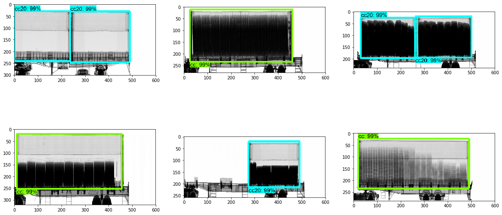

# Arquitetura

## Visão geral

AJNA foi concebido em vários módulos com função especializada.

## Worklow

### Data Workflow

First, the images need to be captured by AVATAR, or provided by terminals APIs. On the 
AVATAR case, it also captures some Operational Systems information (file name and path, data, etc)

Beside the image, the scanning equipment produces a XML file, that contains aditional information.

On old equipment, that is no pattern for the XML, what is a problem for the integration. On future
equipment, there is the WCO proposed UFF file format. 

AJNA is aware of WCO UFF file format and is being designed to import and export UFF, allowing
easy comunication with compliant equipment and customs administrations around the world.

After these initial steps, any source of information can be added to the images database. For this,
scripts have to be designed and added to the integration folder.

The integration module is now part of Virasana module, but is intended to become a separate and
more decoupled module, probably managed by an Apache Workflow configuration.  

### Prediction Workflow

After the images are on database, the computer vision and machine learning models can be used.

For data crossing and for better performance, the models can be included in the
 periodic tasks (on integration module) workflow and their results saved on image metada on DataBase.
 
Also, some models can be trained on the complete image (that includes cargo and 
parts of vehicle and some more noise), but the majority of models are better suited to
run only on cargo/container area. So, a object detection model has to be run first to
register the coordinates of the cargo on original image, like on example above:

