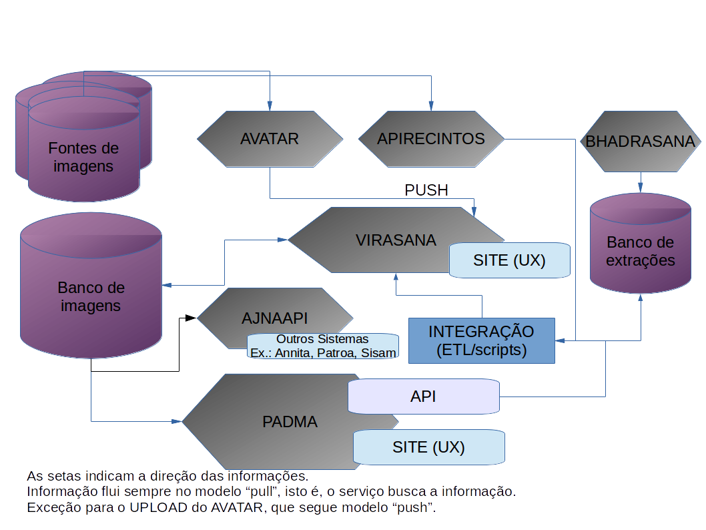

# Arquitetura

## Visão geral

AJNA foi concebido em vários módulos com função especializada.

## Fluxo

### Fluxo de dados

Primeiro, as imagens precisam ser capturadas pelo AVATAR ou fornecidas pelas APIs dos terminais. No
caso do AVATAR, ele também captura algumas informações do Sistema Operacional
 (nome e caminho do arquivo, data de modificação, etc.)

Ao lado da imagem, o equipamento de digitalização produz um arquivo XML, que contém informações adicionais.

Em equipamentos antigos, não há padrão para o XML, o que é um problema para a integração. Para novos equipamentos,
 existe o formato de arquivo UFF proposto pela WCO.

O AJNA está ciente do formato de arquivo WCO UFF e está sendo projetado para importar e exportar UFF, permitindo
comunicação fácil com equipamentos compatíveis e administrações aduaneiras em todo o mundo.

Após essas etapas iniciais, qualquer fonte de informação pode ser adicionada ao banco de dados de imagens. Para isto,
Os scripts devem ser projetados e adicionados à pasta de integração.

O módulo de integração agora faz parte do módulo Virasana, mas pretende se tornar um módulo separado e
mais desacoplado, provavelmente gerenciado por uma configuração do Apache Workflow.

### Fluxo de trabalho de previsão

Depois que as imagens estão no banco de dados, os modelos de visão computacional e aprendizado de máquina podem ser usados.

Para cruzamento de dados e para melhor desempenho, os modelos podem ser incluídos nas
 tarefas periódicas (no módulo de integração) e seus resultados salvos nos metadados da imagem no Banco.
 
Além disso, alguns modelos podem ser treinados na imagem completa (que inclui carga e
partes do veículo mais ruído), mas para a maioria dos modelos é mais adequado selecionar apenas a área da carga/contêiner.
 Portanto, um modelo de detecção de objeto deve ser executado primeiro para
registrar as coordenadas da carga na imagem original, como no exemplo abaixo:

